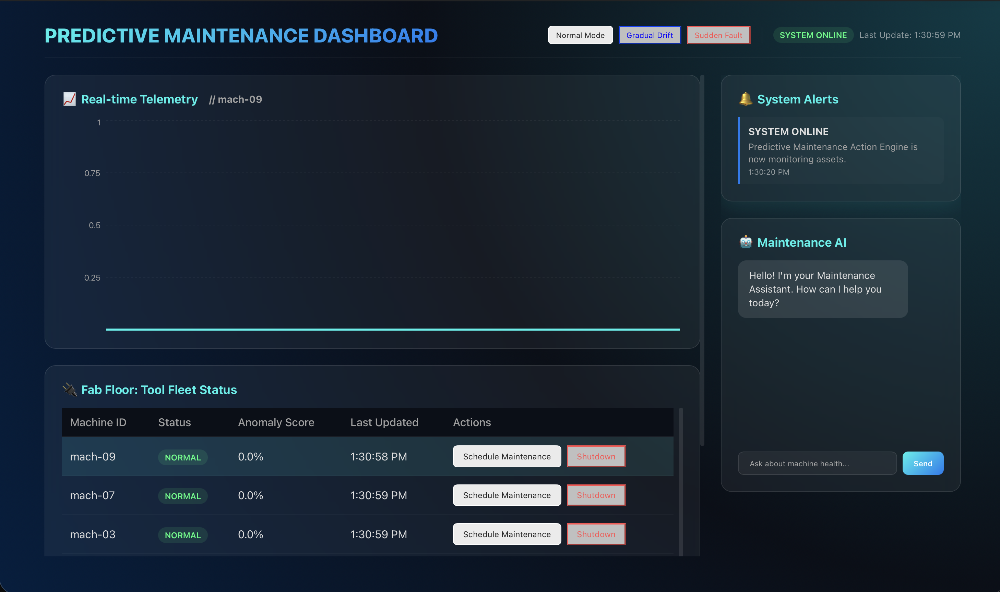
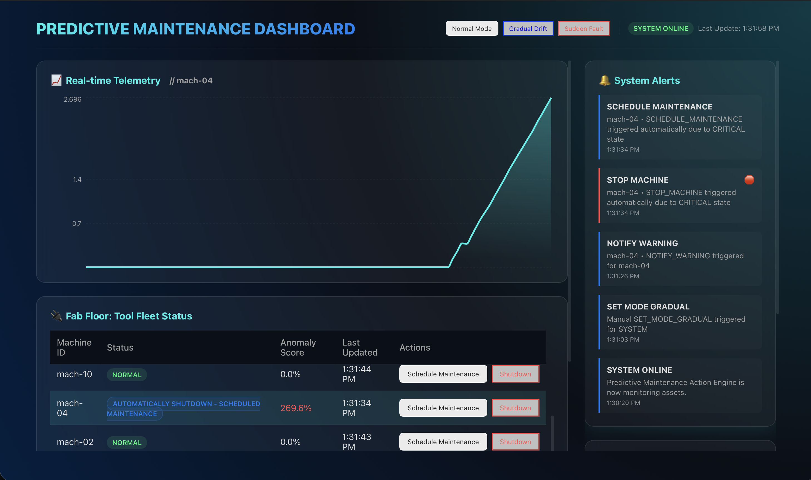
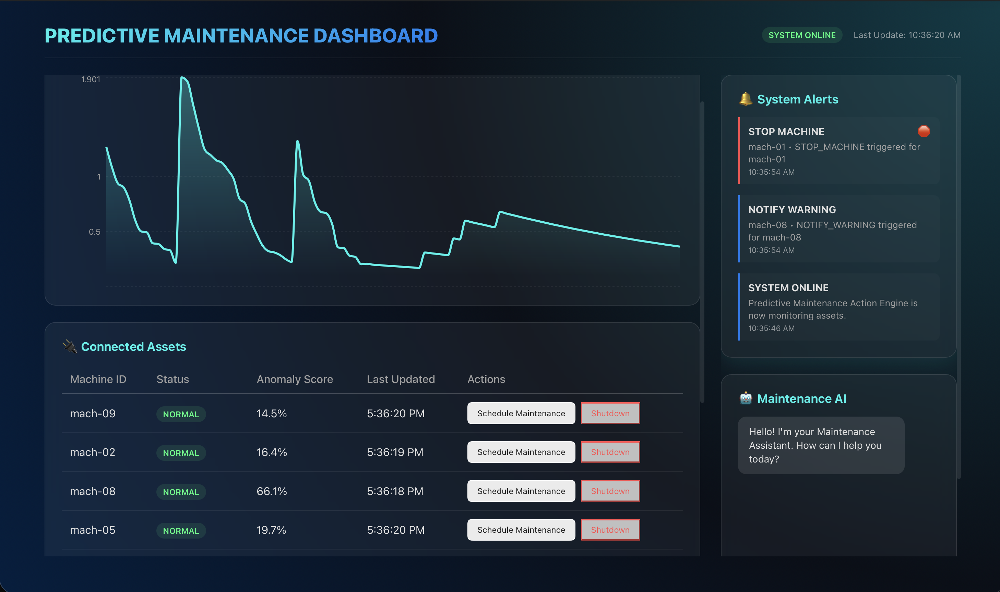

# Predictive Maintenance For Semiconductor Manufacturing Machines

A real-time predictive maintenance system that monitors industrial assets, predicts failures using anomaly scoring, and automatically manages maintenance workflows.

## 🚀 Features

- **Real-time Monitoring**: Live tracking of temperature, vibration, and RPM across multiple machines.
- **Anomaly Scoring**: Stateful risk accumulation to detect gradual drift and sudden faults.
- **Automatic Orchestration**: 
  - Automatic shutdown of failing machines.
  - Cascading shutdowns for dependent assets.
  - Automatic maintenance scheduling with simulated downtime and recovery.
- **Interactive Dashboard**:
  - Live charts for machine metrics.
  - Actionable "Connected Assets" table with manual overrides.
  - Simulation control to trigger different failure modes (Normal, Gradual Drift, Sudden Fault).

## 🛠 Tech Stack

- **Frontend**: React, TypeScript, Vite, CSS (Glassmorphism design).
- **Backend API**: FastAPI.
- **Data Streaming**: Confluent Kafka (Cloud).
- **Processing**: Python based Scoring and Action Engines.

## 📦 Project Structure

```text
.
├── frontend/               # React Dashboard
├── src/
│   ├── api/                # FastAPI application & Kafka consumers
│   ├── actions/            # Logic for automated responses & dependency management
│   ├── scoring/            # Real-time risk scoring stream
│   ├── producer/           # Data simulator & mode controller
│   └── utils/              # Kafka client configurations
└── .gitignore              # Project exclusions
```

## 🚥 Getting Started

### Prerequisites

- Python 3.11+
- Node.js & npm
- Confluent Kafka Cluster (cloud credentials required in `.env`)

### Setup

1. **Environmental Variables**:
   Create a `.env` file in the root with your Confluent credentials.

2. **Backend Setup**:
   ```bash
   python -m venv .venv
   source .venv/bin/activate
   pip install -r src/producer/requirements.txt  # and other sub-dirs
   ```

3. **Frontend Setup**:
   ```bash
   cd frontend
   npm install
   ```

### Running the System

Start the following components in separate terminals:

- **API**: `uvicorn src.api.main:app --reload`
- **Scoring**: `python src/scoring/score_stream.py`
- **Action Engine**: `python -m src.actions.action_engine`
- **Producer**: `python -m src.producer.producer`
- **Frontend**: `cd frontend && npm run dev`

## 🕹 Simulation Modes

Use the dashboard header to switch between:
- **Normal**: Healthy baseline operation.
- **Gradual Drift**: Slow increase in metrics leading to eventual failure.
- **Sudden Fault**: Immediate spike in metrics for emergency shutdown testing.

## 📸 System Demonstration

### 🟢 1. Normal Operation
Baseline behavior where all tools on the Fab floor are operating within normal parameters. Anomaly scores remain low, and the system status is healthy.


### 🟠 2. Gradual Drift & Automatic Maintenance
In this scenario, `mach-04` experiences a gradual drift in its sensor telemetry. The Scoring Engine detects the increasing risk, and once it hits a critical threshold, the Action Engine automatically triggers a shutdown and schedules maintenance. The dashboard reflects the status as "Automatically Shutdown - Scheduled maintenance".


### 🔵 3. System Recovery
After the simulated maintenance period (60 seconds), the tool's state is reset, its drift is cleared, and it resumes data emission. The status returns to "NORMAL", and the anomaly score drops back to the baseline.

